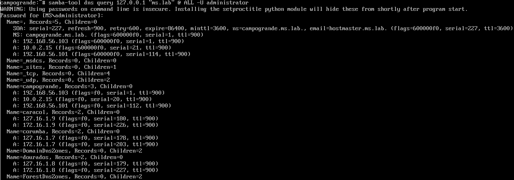

# Registros de Recurso do DNS

Pontuação: 30 pontos
 
Usando comando `samba-tool`, crie 4 registros do DNS do tipo A (Vide Planilha passada no GSA)


Use o seguinte comando para listar todos os registros de sua zona:

- `samba-tool dns query 127.0.0.1 "<estado>.lab" @ ALL -U administrator`


Nesta atividade, foi solicitado o uso do Samba-Tool para adicionar 4 registros DNS do tipo A, associando cada um a um nome de host e seu respectivo endereço IP na zona DNS definida. A seguir, apresento o processo completo de como os registros foram criados e listados na zona DNS, junto com as verificações realizadas.

# Criação de Registros DNS Tipo A com Samba-Tool

## Descrição da Atividade

Nesta atividade, foi solicitado o uso do **Samba-Tool** para adicionar 4 registros DNS do tipo **A**, associando cada um a um nome de host e seu respectivo endereço IP na zona DNS definida. A seguir, apresento o processo completo de como os registros foram criados e listados na zona DNS, junto com as verificações realizadas.

---

## Comandos Utilizados

### Listar Registros DNS

Para listar os registros DNS atuais da zona definida, o comando utilizado foi:


```
samba-tool dns query 127.0.0.1 "ms.lab" @ ALL -U administrator
```

Esse comando lista todos os registros DNS presentes na zona **ms.lab**. Ele pede a senha do usuário administrador para autenticação.

---

## Passo 1: Adicionar Registros do Tipo A

Foram adicionados quatro registros DNS do tipo **A**. Cada comando associou um nome de host a um endereço IP específico na zona **ms.lab**.

### Registro: corumba.ms.lab

Associando o nome do host `corumba` ao endereço IP `172.16.1.7`:

```
samba-tool dns add 127.0.0.1 ms.lab corumba A 127.16.1.7 -U administrador
```

### Registro: dourados.ms.lab

Associando o nome do host `dourados` ao endereço IP `172.16.1.8`:

```
samba-tool dns add 127.0.0.1 ms.lab dourados A 127.16.1.8 -U administrador
```

### Registro: caracol.ms.lab

Associando o nome do host `caracol` ao endereço IP `172.16.1.9`:

```
samba-tool dns add 127.0.0.1 ms.lab caracol A 127.16.1.9 -U administrador
```

### Confira a adição de hosts:
  - **Adição de hosts:**:
    


---

## Passo 2: Verificar os Registros Adicionados

Após a adição dos registros, o comando a seguir foi utilizado novamente para verificar todos os registros na zona:

```
samba-tool dns query 127.0.0.1 "ms.lab" @ ALL -U administrator
```

Esse comando permite listar os registros para confirmar que os novos registros do tipo **A** foram corretamente inseridos.

---

## Resultados

Abaixo estão os comandos de verificação executados e a confirmação da criação dos registros DNS do tipo **A**:

- **Comando para listar os registros**:

  ```
  samba-tool dns query 127.0.0.1 "ms.lab" @ ALL -U administrator
  ```

- **Adição dos registros A**:

  - **Registro corumba.ms.lab**:
    


---

## Conclusão

Os registros DNS do tipo **A** foram criados com sucesso na zona **ms.lab**, associando os respectivos endereços IP aos nomes de host indicados. A verificação final confirma que os registros foram adicionados corretamente, o que pode ser visto na listagem de registros após a execução dos comandos.

